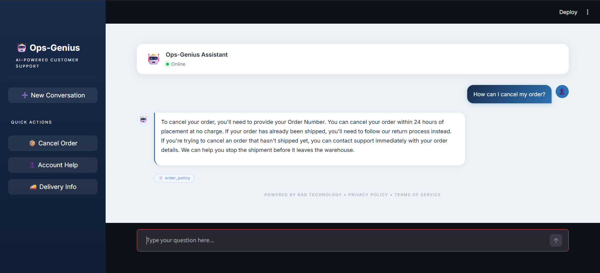
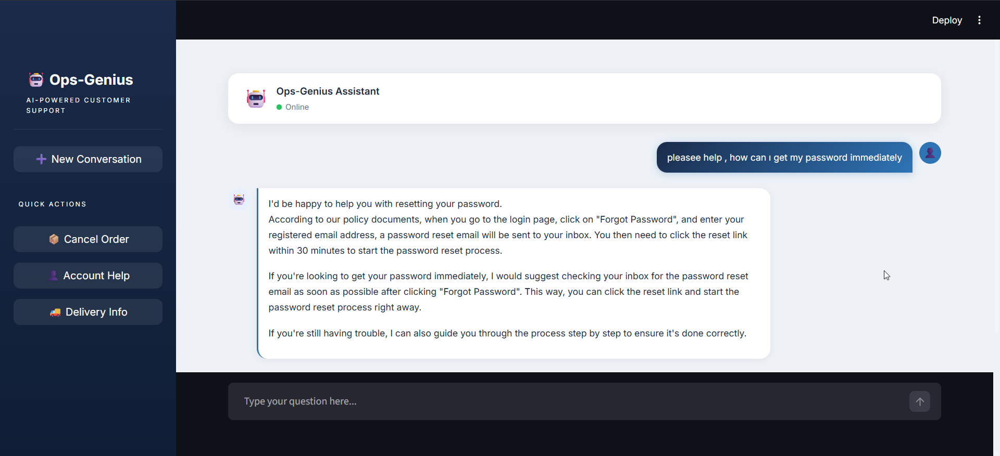
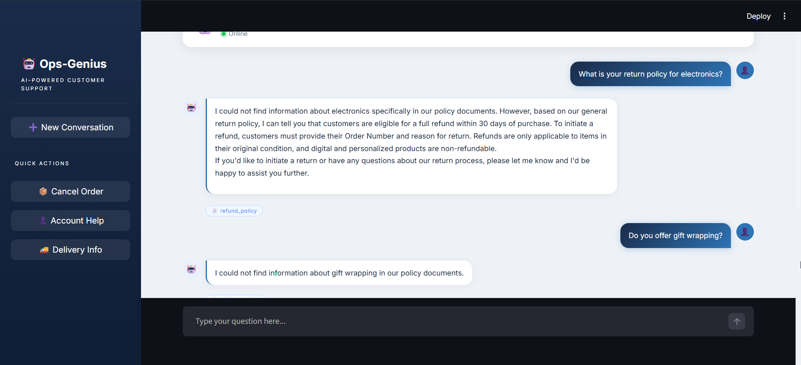

# Ops-Genius: An Operational Efficiency-Oriented Intelligent Customer Support System

> Graduation Thesis Project — Çukurova University, Department of Computer Engineering  
> Student: Hasibe Nur Tunç (2021556067) | Advisor: Prof. Dr. Umut Orhan

---

## Overview

Ops-Genius is an AI-powered customer support system built on **Retrieval-Augmented Generation (RAG)** architecture. Instead of generating responses from memorized training data, the system retrieves relevant content from corporate policy documents and generates evidence-based, explainable answers grounded in those documents.

The system was developed to address common inefficiencies in customer support processes such as inconsistent responses, delayed answers, and lack of traceability.

---


##  Screenshots & Demo

| Chat Interface 1  | Chat Interface 2 | Chat Interface 3 |
|---|---|---|
|  |  |  |

---

## Key Features

- **Evidence-based responses** — Every answer is retrieved from a policy document, not generated from model memory
- **Source attribution** — Each response displays which document it came from (e.g., `order_policy`, `account_policy`)
- **Hallucination resistance** — Questions outside the knowledge base return "could not find" instead of fabricated answers
- **Linguistic robustness** — Handles slang, abbreviations, typos, indirect phrasing, and multi-intent queries
- **Interactive web interface** — Built with Streamlit, includes quick-action sidebar buttons and chat history

---

## System Architecture

```
User Query
    ↓
Embedding Model (all-MiniLM-L6-v2)
    ↓
ChromaDB Vector Search
    ↓
Top-K Relevant Chunks Retrieved
    ↓
Groq API (Llama 3.1 8B) + Context
    ↓
Response + Source Document
```

---

## Technology Stack

| Component | Technology |
|---|---|
| RAG Framework | LangChain |
| Language Model | Groq API — Llama 3.1 8B |
| Embedding Model | sentence-transformers/all-MiniLM-L6-v2 |
| Vector Database | ChromaDB |
| Text Splitter | RecursiveCharacterTextSplitter (500 tokens, 50 overlap) |
| Web Interface | Streamlit |
| Dataset | Bitext Customer Support (HuggingFace) |

---

## Dataset

**Bitext Customer Support LLM Chatbot Training Dataset**  
Source: [HuggingFace](https://huggingface.co/datasets/bitext/Bitext-customer-support-llm-chatbot-training-dataset)

- 26,872 real customer support interactions
- 27 intent categories
- 5 columns: `instruction`, `intent`, `category`, `response` (ground truth), `flags`

For this project, 3 intent categories were selected:

| Intent | Category | Description |
|---|---|---|
| `cancel_order` | ORDER | Order cancellation requests |
| `recover_password` | ACCOUNT | Password and credential recovery |
| `delivery_options` | DELIVERY | Shipping method inquiries |

---

## Knowledge Base

Since the Bitext dataset does not include policy documents, a synthetic knowledge base was constructed using publicly available corporate policies (Amazon, PayPal, Shopify, FedEx) as references.

| Document | Intent Categories Covered |
|---|---|
| `order_policy.txt` | cancel_order, change_order, place_order, track_order |
| `refund_policy.txt` | get_refund, track_refund, check_refund_policy, payment_issue |
| `account_policy.txt` | create_account, delete_account, recover_password, registration_problems |
| `delivery_policy.txt` | delivery_period, delivery_options, set_up_shipping_address |
| `support_policy.txt` | contact_customer_service, complaint, review |

---

## Test Results

### Phase 1 — Initial Baseline (54 queries, 27 intents)

| Metric | Value |
|---|---|
| Total Queries | 54 |
| Successful | 30 (55.6%) |
| Failed | 24 (44.4%) |

### Phase 2 — After Optimization (300 queries, 3 intents)

**Controlled Test:**

| Intent | Before | After |
|---|---|---|
| cancel_order | 85% | 94% |
| delivery_options | 53% | 99% |
| recover_password | 23% | 95% |
| **Overall** | **53.7%** | **98.7%** |

**Manipulation Test (15 queries):** 86.7%  
**Hybrid Stress Test (10 queries):** 100%

### Failure Analysis

| Failure Type | Description | Solution Applied |
|---|---|---|
| Placeholder Tokens | `{{Order Number}}`, `{{Delivery City}}` in queries | Preprocessing cleanup |
| Synonym Mismatch | "PIN code", "access key" vs "password" | Document enrichment |
| Indirect Phrasing | "stop my shipment" vs "cancel order" | Prompt + document update |

---

## Project Structure

```
ops-genius/
├── docs/
│   ├── order_policy.txt
│   ├── refund_policy.txt
│   ├── account_policy.txt
│   ├── delivery_policy.txt
│   └── support_policy.txt
├── chroma_db/                  ← Vector database (auto-generated)
├── phase2/
│   ├── filter_dataset.py       ← Dataset filtering (300 rows)
│   ├── filtered_dataset.csv
│   ├── test_controlled.py      ← Controlled test (300 queries)
│   ├── test_manipulated.py     ← Manipulation test (15 queries)
│   ├── test_hybrid.py          ← Hybrid stress test (10 queries)
│   ├── analyze_failed.py       ← Failure analysis
│   └── results/
│       ├── controlled_results.csv
│       ├── manipulated_results.csv
│       └── hybrid_results.csv
├── app.py                      ← Streamlit web interface
├── rag_pipeline.py             ← RAG pipeline + ChromaDB indexing
├── demo.py                     ← Terminal demo
├── explore_data.py             ← Dataset exploration
├── test_with_bitext.py         ← Full dataset test
├── analyze_results.py          ← Results analysis
├── .env                        ← API keys (not committed)
└── requirements.txt
```

---

## Installation

**1. Clone the repository:**
```bash
git clone https://github.com/yourusername/ops-genius.git
cd ops-genius
```

**2. Create virtual environment:**
```bash
python -m venv venv
venv\Scripts\activate      # Windows
source venv/bin/activate   # Mac/Linux
```

**3. Install dependencies:**
```bash
pip install -r requirements.txt
```

**4. Create `.env` file:**
```
GROQ_API_KEY=your_groq_api_key_here
```

Get your free Groq API key at: [console.groq.com](https://console.groq.com)

**5. Build the vector database:**
```bash
python rag_pipeline.py
```

**6. Run the web interface:**
```bash
streamlit run app.py
```

---

## Usage

**Web Interface:**
```bash
streamlit run app.py
```

**Terminal Demo:**
```bash
python demo.py
```

**Run Tests:**
```bash
python phase2/test_controlled.py
python phase2/test_manipulated.py
python phase2/test_hybrid.py
```

---

## Requirements

```
langchain
langchain-groq
langchain-chroma
langchain-huggingface
langchain-text-splitters
langchain-core
chromadb
sentence-transformers
datasets
pandas
streamlit
python-dotenv
```

---

## Academic Context

This project was developed as a graduation thesis at Çukurova University, Faculty of Engineering, Department of Computer Engineering.

**Research Focus:** Evaluating RAG architecture for customer support automation, with emphasis on explainability, hallucination detection, and linguistic robustness.

**Evaluation Methodology:**
- Controlled testing with original dataset queries
- Manipulation testing with rephrased and linguistically varied queries
- Hybrid stress testing with complex multi-intent queries
- Ground truth comparison using the `response` column of the Bitext dataset

---

## References

- Lewis et al. (2020). Retrieval-Augmented Generation for Knowledge-Intensive NLP Tasks. NeurIPS 2020.
- Gao et al. (2023). Retrieval-Augmented Generation for Large Language Models: A Survey. arXiv.
- Es et al. (2023). RAGAS: Automated Evaluation of Retrieval Augmented Generation. arXiv.
- Bitext. (2024). Bitext Customer Support LLM Chatbot Training Dataset. HuggingFace.

---

## License

This project is developed for academic purposes.
